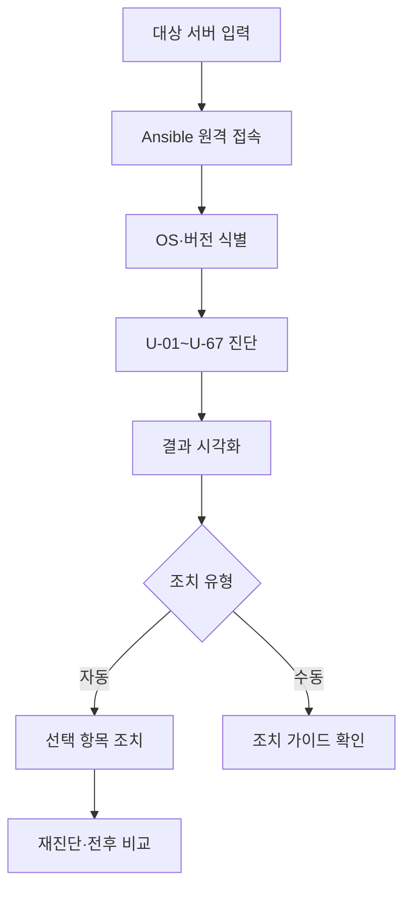

이거 말하는거맞음 ? 

marketplace가야되는거아냐 ? 

이거아냐 ??

알겠어. 멈춰둘게.


햇슴 . 

52s 동안 처리함
응. 지금 GitHub main 기준으로는 최종 구조가 정상적으로 반영됐어.

확인 결과:

대시보드 메뉴: main / 진단 및 조치 / nuclei / 기록

단일·다중 서버 진단 기능 포함

Ansible 진단 플레이북 포함

선택적 자동 조치 및 수동 조치 분리 포함

조치 후 재진단·전후 비교 포함

Nuclei 자동·수동 스캔 UI와 실행 코드 포함

Excel 결과 저장과 이력 관리 포함

Rocky 9·10 진단 코드: 각각 67개

Ubuntu 진단 코드: 67개

Rocky 9·10 조치 함수: 각각 67개

Ubuntu 자동 조치 함수: 48개

수동 조치 PDF 가이드 2종 포함

Python과 전체 Shell 스크립트 문법 검사 통과

중첩된 ZIP 폴더와 생성 보고서 제거 완료

README도 루트에 정상 표시

참고로 nuclei-templates 전체는 용량 때문에 의도적으로 제외돼 있어. 실제 Nuclei 스캔 시 README 안내대로 별도 설치해야 해. 실제 서버에 SSH로 연결해 진단·조치를 실행하는 통합 테스트는 이 환경에서 수행하지 못했지만, 코드·경로·문법 연결은 정상적으로 확인했어.

남은 권장 사항은 .gitignore 하나 추가하는 것뿐이야. 현재 기능상 누락은 없지만, 이후 __pycache__, 임시 인벤토리, 결과 파일이 다시 올라가는 것을 막으려면 추가하는 게 좋아. 현재 저장소 확인


엉 추가해주라 그리고 readme 지금 자세하게 작성되어 있는거 맞는지 ? 글고 kisa 가이드라인 2026년거 제대로된 명으로 명시해주고 readme파일 다시 한번 포트폴리오로 제출하기 좋은 방식으로 정리해주라 잘 드러나게 

3m 46s 동안 처리함
정리 완료했습니다. 기존 README도 상세했지만, 이번 버전은 포트폴리오 심사자가 핵심 성과와 개인 담당 영역을 먼저 볼 수 있도록 재구성했습니다.

주요 변경점:

KISA 공식 문서명을 정확하게 표기

주요정보통신기반시설 기술적 취약점 분석·평가 방법 상세가이드

2025.12.24 공개본 / 프로젝트 적용연도 2026으로 구분

공식 제목 자체에는 2026이 포함되지 않습니다. KISA 공식 게시물

진단 67개 × 3개 OS, 자동 조치 48개, 수동 검토 19개를 상단에서 강조

개인 담당 영역과 팀 공동 결과물을 구분

문제–해결–결과 형식 추가

대시보드, 진단·조치, 재진단, Nuclei, 이력 기능 정리

현재 저장소 자체 점검 결과와 실제 원격 테스트 제한사항 명시

인증정보·실행 결과·Nuclei 템플릿 등이 올라가지 않도록 .gitignore 추가

파일:

README.md

.gitignore

현재는 읽기 전용이라 GitHub 저장소에 자동 반영되지는 않았습니다. 두 파일을 저장소 최상단에 업로드하고 아래 메시지로 커밋하면 됩니다.

docs: 포트폴리오 README 및 gitignore 정리

README.md


# Linux Security Automation

> KISA 기준에 따라 Linux 서버의 보안 취약점을 진단하고, 운영 영향을 고려해 선택적으로 조치한 뒤 재진단까지 수행하는 자동화 프로젝트

Ansible과 Shell Script로 원격 서버의 보안 설정을 점검하고, Streamlit 대시보드에서 결과 확인·선택 조치·재진단·이력 관리를 수행합니다.

## 프로젝트 한눈에 보기

| 항목 | 내용 |
| --- | --- |
| 기준 문서 | KISA 「주요정보통신기반시설 기술적 취약점 분석·평가 방법 상세가이드」 |
| 문서 기준 | 2025년 12월 24일 공개본 / 프로젝트 적용연도 2026 |
| 진단 범위 | UNIX 서버 U-01~U-67, OS별 67개 항목 |
| 지원 환경 | Rocky Linux 9, Rocky Linux 10, Ubuntu 24.04 |
| 조치 범위 | 대시보드 기준 자동 조치 48개, 운영자 검토·수동 조치 19개 |
| 실행 방식 | Ansible 기반 단일·다중 서버 원격 실행 |
| 결과 관리 | 취약 항목 시각화, 보안 수준 계산, Excel 저장·다운로드, 이력 조회 |
| 팀 구성 | 5인 팀 프로젝트 |

> 기준 문서의 공식 제목에는 연도가 포함되지 않습니다. 이 프로젝트는 KISA가 2025년 12월 24일 공개한 문서를 2026년 프로젝트 기준으로 적용했습니다.

## 핵심 성과

- **67개 진단 항목 × 3개 OS 스크립트**: Rocky Linux 9·10과 Ubuntu 24.04의 설정·명령 차이를 반영했습니다.
- **진단 → 선택 조치 → 재진단**: 설정 변경 전후 결과를 한 흐름에서 비교할 수 있도록 구성했습니다.
- **자동화 범위의 안전한 분리**: 48개 항목은 대시보드에서 선택 조치하고, 운영 영향이 큰 19개 항목은 수동 검토 대상으로 분리했습니다.
- **단일·다중 서버 지원**: 직접 입력과 CSV 업로드를 통해 여러 서버를 같은 기준으로 점검할 수 있습니다.
- **결과 표준화**: 항목별 결과를 JSON으로 통일해 대시보드 파싱과 결과 집계를 안정화했습니다.

## 담당 역할

5인 팀 프로젝트에서 **Linux 보안 진단·조치 자동화 영역**을 중심으로 담당했습니다.

- KISA UNIX 서버 U-01~U-67 진단 로직을 Rocky Linux와 Ubuntu용 Shell Script로 구현
- 자동 조치 가능 항목과 운영자 판단이 필요한 항목을 분류하고 조치 로직 구성
- Ansible 플레이북과 Shell Script를 연결해 원격 진단·선택 조치·재진단 흐름 구현
- 진단 결과의 JSON 출력 형식을 표준화하고 Streamlit 대시보드 연동
- 서비스 미설치, 권한 부족, OS별 명령·설정 경로 차이를 고려한 예외 처리

공동 결과물인 대시보드·Nuclei 연동·결과 관리 기능은 저장소에 함께 포함되어 있으며, 위 항목은 그중 개인 담당 영역을 중심으로 정리한 내용입니다.

## 문제 정의와 해결 방식

| 문제 | 해결 방식 | 결과 |
| --- | --- | --- |
| 배포판과 버전별 명령·설정 경로가 다름 | OS와 주 버전을 식별하고 진단·조치 스크립트를 분리 | Rocky 9·10, Ubuntu 24.04를 동일한 UI에서 점검 |
| 항목마다 출력 형식이 달라 결과 파싱이 불안정함 | `code`, `item`, `severity`, `status`, `reason` 필드를 갖는 JSON 한 줄 형식으로 통일 | 대시보드 집계·정렬·시각화 로직 단순화 |
| 모든 취약 설정을 일괄 변경하면 운영 장애 위험이 있음 | 자동 조치 48개와 수동 검토 19개를 분리하고 선택한 항목만 실행 | 자동화 편의성과 운영 안전성의 균형 확보 |
| 조치 실행만으로는 개선 여부를 확인하기 어려움 | 조치 직후 동일 항목을 재진단해 전후 상태 비교 | 조치 결과를 화면에서 즉시 확인 |

## 동작 흐름



## 주요 기능

### 1. Linux 보안 진단

- IP·계정 입력 기반 단일 서버 진단
- CSV 업로드 기반 다중 서버 일괄 진단
- KISA UNIX 서버 U-01~U-67 점검
- 중요도, 양호·취약 상태, 판단 근거를 JSON으로 표준화
- 취약 항목 우선 정렬과 중요도별 가중치를 활용한 보안 수준 표시

### 2. 선택적 조치와 재진단

- 취약 항목 중 자동 조치 대상을 사용자가 직접 선택
- Ansible Extra Variables로 U-code를 전달해 해당 조치 함수만 실행
- 조치 후 동일 항목을 재진단해 개선 여부와 보안 수준 변화 비교
- 운영자 판단이 필요한 19개 항목은 자동 실행에서 제외하고 PDF 가이드 제공

### 3. 대시보드와 이력 관리

- 메인, 진단 및 조치, Nuclei, 기록 메뉴 제공
- 진단 결과 테이블과 취약 항목 강조 표시
- Excel 결과 저장·다운로드와 이전 진단 이력 조회
- 진단 서버 목록 관리와 단일·다중 서버 실행 지원

### 4. Nuclei 추가 점검

- Nuclei 템플릿 기반 웹·네트워크 취약점 스캔
- 자동 모드와 허용 범위가 제한된 수동 명령 모드 제공
- 미탐지와 실행 오류를 구분해 결과 표시

## 기술 스택

| 영역 | 기술 |
| --- | --- |
| Dashboard | Python, Streamlit, Pandas, Plotly |
| Remote Automation | Ansible |
| Security Check & Remedy | Bash, KISA UNIX U-01~U-67 |
| Additional Scan | Nuclei |
| Export | OpenPyXL, python-docx, ReportLab |
| Target OS | Rocky Linux 9·10, Ubuntu 24.04 |

## 프로젝트 구조

```text
.
├── app.py                              # Streamlit 실행 진입점
├── requirements.txt                   # Python 의존성
├── README.md
└── src
    ├── guides                         # 수동 조치 PDF 가이드
    └── dashboard_0210
        ├── ansible.cfg
        ├── check_playbook.yml          # 원격 진단 플레이북
        ├── remedy_playbook.yml         # 선택 조치 플레이북
        ├── scripts
        │   ├── check
        │   │   ├── rocky_check_9.sh
        │   │   ├── rocky_check_10.sh
        │   │   └── ubuntu_check.sh
        │   ├── remedy
        │   │   ├── rocky_remedy_9.sh
        │   │   ├── rocky_remedy_10.sh
        │   │   └── ubuntu_remedy.sh
        │   └── nuclei
        │       └── nuclei_check.py
        ├── templates
        ├── images
        └── styles.css
```

`nuclei-templates`, 임시 인벤토리, 진단 결과, 생성 보고서와 인증정보는 저장소에 포함하지 않습니다.

## 실행 방법

### 1. Python 환경 준비

```bash
python3 -m venv .venv
source .venv/bin/activate
pip install -r requirements.txt
```

### 2. Ansible 설치

Ubuntu/Debian 계열 제어 노드의 예시는 다음과 같습니다.

```bash
sudo apt update
sudo apt install -y ansible
```

### 3. Nuclei 템플릿 준비 (선택)

```bash
git clone --depth 1 https://github.com/projectdiscovery/nuclei-templates.git \
  src/dashboard_0210/nuclei-templates
```

Nuclei를 사용하지 않는 경우 템플릿 설치 없이 Linux 진단·조치 기능만 사용할 수 있습니다. Nuclei 실행 파일은 별도로 설치되어 있어야 합니다.

### 4. 대시보드 실행

```bash
streamlit run app.py
```

대상 서버에는 SSH 접속 권한과 점검 명령을 실행할 권한이 필요합니다.

## 저장소 자체 점검 결과

현재 `main` 브랜치의 코드 구성을 기준으로 확인한 결과입니다.

| 검증 항목 | 결과 |
| --- | --- |
| Python 구문 검사 (`app.py`, `nuclei_check.py`) | 통과 |
| Shell 구문 검사 (진단·조치 스크립트 6개) | 통과 |
| 진단 함수 수 | Rocky 9: 67 / Rocky 10: 67 / Ubuntu: 67 |
| 대시보드 메뉴 | 메인 / 진단 및 조치 / Nuclei / 기록 |
| 진단·조치 플레이북 연결 | 확인 |
| 조치 후 재진단 흐름 | 확인 |

실제 원격 SSH 환경에서의 통합 테스트는 대상 서버의 OS, 권한, 서비스 구성에 따라 별도로 수행해야 합니다.

## 안전 및 사용 범위

- 반드시 점검·조치 권한을 승인받은 서버에서만 사용해야 합니다.
- 자동 조치 전 설정 파일과 중요 데이터를 백업하고 변경 승인 절차를 따라야 합니다.
- 계정, 인증, 네트워크, 서비스 설정 변경은 운영 중인 시스템에 영향을 줄 수 있습니다.
- 임시 인벤토리에는 SSH 인증정보가 포함될 수 있으므로 저장소에 커밋하거나 장기간 보관하지 않습니다.
- 본 프로젝트는 교육·검증 환경을 기준으로 구현했으며, 운영 적용 전 항목별 영향도 검토가 필요합니다.

## 참고 기준

- [KISA 주요정보통신기반시설 기술적 취약점 분석·평가 방법 상세가이드](https://www.kisa.or.kr/2060204/form?postSeq=22&page=1) — 2025.12.24 공개
- KISA UNIX 서버 취약점 점검 항목 U-01~U-67

## Team

5인 팀 프로젝트입니다. 저장소에는 공동 결과물과 개인 담당 영역이 함께 포함되어 있습니다.
README.md


# Linux Security Automation

> KISA 기준에 따라 Linux 서버의 보안 취약점을 진단하고, 운영 영향을 고려해 선택적으로 조치한 뒤 재진단까지 수행하는 자동화 프로젝트

Ansible과 Shell Script로 원격 서버의 보안 설정을 점검하고, Streamlit 대시보드에서 결과 확인·선택 조치·재진단·이력 관리를 수행합니다.

## 프로젝트 한눈에 보기

| 항목 | 내용 |
| --- | --- |
| 기준 문서 | KISA 「주요정보통신기반시설 기술적 취약점 분석·평가 방법 상세가이드」 |
| 문서 기준 | 2025년 12월 24일 공개본 / 프로젝트 적용연도 2026 |
| 진단 범위 | UNIX 서버 U-01~U-67, OS별 67개 항목 |
| 지원 환경 | Rocky Linux 9, Rocky Linux 10, Ubuntu 24.04 |
| 조치 범위 | 대시보드 기준 자동 조치 48개, 운영자 검토·수동 조치 19개 |
| 실행 방식 | Ansible 기반 단일·다중 서버 원격 실행 |
| 결과 관리 | 취약 항목 시각화, 보안 수준 계산, Excel 저장·다운로드, 이력 조회 |
| 팀 구성 | 5인 팀 프로젝트 |

> 기준 문서의 공식 제목에는 연도가 포함되지 않습니다. 이 프로젝트는 KISA가 2025년 12월 24일 공개한 문서를 2026년 프로젝트 기준으로 적용했습니다.

## 핵심 성과

- **67개 진단 항목 × 3개 OS 스크립트**: Rocky Linux 9·10과 Ubuntu 24.04의 설정·명령 차이를 반영했습니다.
- **진단 → 선택 조치 → 재진단**: 설정 변경 전후 결과를 한 흐름에서 비교할 수 있도록 구성했습니다.
- **자동화 범위의 안전한 분리**: 48개 항목은 대시보드에서 선택 조치하고, 운영 영향이 큰 19개 항목은 수동 검토 대상으로 분리했습니다.
- **단일·다중 서버 지원**: 직접 입력과 CSV 업로드를 통해 여러 서버를 같은 기준으로 점검할 수 있습니다.
- **결과 표준화**: 항목별 결과를 JSON으로 통일해 대시보드 파싱과 결과 집계를 안정화했습니다.

## 담당 역할

5인 팀 프로젝트에서 **Linux 보안 진단·조치 자동화 영역**을 중심으로 담당했습니다.

- KISA UNIX 서버 U-01~U-67 진단 로직을 Rocky Linux와 Ubuntu용 Shell Script로 구현
- 자동 조치 가능 항목과 운영자 판단이 필요한 항목을 분류하고 조치 로직 구성
- Ansible 플레이북과 Shell Script를 연결해 원격 진단·선택 조치·재진단 흐름 구현
- 진단 결과의 JSON 출력 형식을 표준화하고 Streamlit 대시보드 연동
- 서비스 미설치, 권한 부족, OS별 명령·설정 경로 차이를 고려한 예외 처리

공동 결과물인 대시보드·Nuclei 연동·결과 관리 기능은 저장소에 함께 포함되어 있으며, 위 항목은 그중 개인 담당 영역을 중심으로 정리한 내용입니다.

## 문제 정의와 해결 방식

| 문제 | 해결 방식 | 결과 |
| --- | --- | --- |
| 배포판과 버전별 명령·설정 경로가 다름 | OS와 주 버전을 식별하고 진단·조치 스크립트를 분리 | Rocky 9·10, Ubuntu 24.04를 동일한 UI에서 점검 |
| 항목마다 출력 형식이 달라 결과 파싱이 불안정함 | `code`, `item`, `severity`, `status`, `reason` 필드를 갖는 JSON 한 줄 형식으로 통일 | 대시보드 집계·정렬·시각화 로직 단순화 |
| 모든 취약 설정을 일괄 변경하면 운영 장애 위험이 있음 | 자동 조치 48개와 수동 검토 19개를 분리하고 선택한 항목만 실행 | 자동화 편의성과 운영 안전성의 균형 확보 |
| 조치 실행만으로는 개선 여부를 확인하기 어려움 | 조치 직후 동일 항목을 재진단해 전후 상태 비교 | 조치 결과를 화면에서 즉시 확인 |

## 동작 흐름


## 주요 기능

### 1. Linux 보안 진단

- IP·계정 입력 기반 단일 서버 진단
- CSV 업로드 기반 다중 서버 일괄 진단
- KISA UNIX 서버 U-01~U-67 점검
- 중요도, 양호·취약 상태, 판단 근거를 JSON으로 표준화
- 취약 항목 우선 정렬과 중요도별 가중치를 활용한 보안 수준 표시

### 2. 선택적 조치와 재진단

- 취약 항목 중 자동 조치 대상을 사용자가 직접 선택
- Ansible Extra Variables로 U-code를 전달해 해당 조치 함수만 실행
- 조치 후 동일 항목을 재진단해 개선 여부와 보안 수준 변화 비교
- 운영자 판단이 필요한 19개 항목은 자동 실행에서 제외하고 PDF 가이드 제공

### 3. 대시보드와 이력 관리

- 메인, 진단 및 조치, Nuclei, 기록 메뉴 제공
- 진단 결과 테이블과 취약 항목 강조 표시
- Excel 결과 저장·다운로드와 이전 진단 이력 조회
- 진단 서버 목록 관리와 단일·다중 서버 실행 지원

### 4. Nuclei 추가 점검

- Nuclei 템플릿 기반 웹·네트워크 취약점 스캔
- 자동 모드와 허용 범위가 제한된 수동 명령 모드 제공
- 미탐지와 실행 오류를 구분해 결과 표시

## 기술 스택

| 영역 | 기술 |
| --- | --- |
| Dashboard | Python, Streamlit, Pandas, Plotly |
| Remote Automation | Ansible |
| Security Check & Remedy | Bash, KISA UNIX U-01~U-67 |
| Additional Scan | Nuclei |
| Export | OpenPyXL, python-docx, ReportLab |
| Target OS | Rocky Linux 9·10, Ubuntu 24.04 |

## 프로젝트 구조

```text
.
├── app.py                              # Streamlit 실행 진입점
├── requirements.txt                   # Python 의존성
├── README.md
└── src
    ├── guides                         # 수동 조치 PDF 가이드
    └── dashboard_0210
        ├── ansible.cfg
        ├── check_playbook.yml          # 원격 진단 플레이북
        ├── remedy_playbook.yml         # 선택 조치 플레이북
        ├── scripts
        │   ├── check
        │   │   ├── rocky_check_9.sh
        │   │   ├── rocky_check_10.sh
        │   │   └── ubuntu_check.sh
        │   ├── remedy
        │   │   ├── rocky_remedy_9.sh
        │   │   ├── rocky_remedy_10.sh
        │   │   └── ubuntu_remedy.sh
        │   └── nuclei
        │       └── nuclei_check.py
        ├── templates
        ├── images
        └── styles.css
```

`nuclei-templates`, 임시 인벤토리, 진단 결과, 생성 보고서와 인증정보는 저장소에 포함하지 않습니다.

## 실행 방법

### 1. Python 환경 준비

```bash
python3 -m venv .venv
source .venv/bin/activate
pip install -r requirements.txt
```

### 2. Ansible 설치

Ubuntu/Debian 계열 제어 노드의 예시는 다음과 같습니다.

```bash
sudo apt update
sudo apt install -y ansible
```

### 3. Nuclei 템플릿 준비 (선택)

```bash
git clone --depth 1 https://github.com/projectdiscovery/nuclei-templates.git \
  src/dashboard_0210/nuclei-templates
```

Nuclei를 사용하지 않는 경우 템플릿 설치 없이 Linux 진단·조치 기능만 사용할 수 있습니다. Nuclei 실행 파일은 별도로 설치되어 있어야 합니다.

### 4. 대시보드 실행

```bash
streamlit run app.py
```

대상 서버에는 SSH 접속 권한과 점검 명령을 실행할 권한이 필요합니다.

## 저장소 자체 점검 결과

현재 `main` 브랜치의 코드 구성을 기준으로 확인한 결과입니다.

| 검증 항목 | 결과 |
| --- | --- |
| Python 구문 검사 (`app.py`, `nuclei_check.py`) | 통과 |
| Shell 구문 검사 (진단·조치 스크립트 6개) | 통과 |
| 진단 함수 수 | Rocky 9: 67 / Rocky 10: 67 / Ubuntu: 67 |
| 대시보드 메뉴 | 메인 / 진단 및 조치 / Nuclei / 기록 |
| 진단·조치 플레이북 연결 | 확인 |
| 조치 후 재진단 흐름 | 확인 |

실제 원격 SSH 환경에서의 통합 테스트는 대상 서버의 OS, 권한, 서비스 구성에 따라 별도로 수행해야 합니다.

## 안전 및 사용 범위

- 반드시 점검·조치 권한을 승인받은 서버에서만 사용해야 합니다.
- 자동 조치 전 설정 파일과 중요 데이터를 백업하고 변경 승인 절차를 따라야 합니다.
- 계정, 인증, 네트워크, 서비스 설정 변경은 운영 중인 시스템에 영향을 줄 수 있습니다.
- 임시 인벤토리에는 SSH 인증정보가 포함될 수 있으므로 저장소에 커밋하거나 장기간 보관하지 않습니다.
- 본 프로젝트는 교육·검증 환경을 기준으로 구현했으며, 운영 적용 전 항목별 영향도 검토가 필요합니다.

## 참고 기준

- [KISA 주요정보통신기반시설 기술적 취약점 분석·평가 방법 상세가이드](https://www.kisa.or.kr/2060204/form?postSeq=22&page=1) — 2025.12.24 공개
- KISA UNIX 서버 취약점 점검 항목 U-01~U-67

## Team

5인 팀 프로젝트입니다. 저장소에는 공동 결과물과 개인 담당 영역이 함께 포함되어 있습니다.
